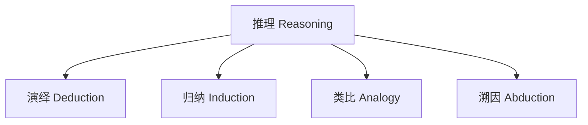
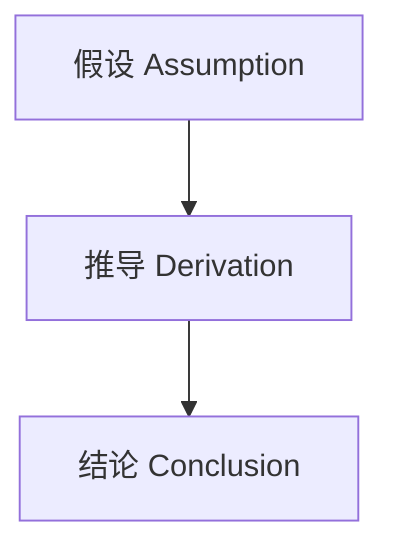

# 数字化与可视化资源 Digital & Visualization Resources

## 一、知识图谱 Knowledge Graphs

- 各模块可用Mermaid、MindMeister等工具绘制知识图谱
- Knowledge graphs for all modules can be created using tools like Mermaid, MindMeister, etc.

### 示例：推理类型知识图谱（Mermaid）

## 二、思维导图模板 Mind Map Templates

- 推荐使用MindMeister、XMind等工具，模板结构包括：主题-分支-子主题-案例
- Use MindMeister, XMind, etc. Templates: Topic - Branch - Subtopic - Case

## 三、论证地图 Argument Mapping

- 利用Rationale、Kialo等工具制作论证结构图，提升论证分析能力
- Use Rationale, Kialo, etc. to create argument maps and enhance argument analysis skills

## 四、互动课件建议 Interactive Courseware Suggestions

- 利用Khan Academy、PhET等平台制作推理类型、论证结构、批判性思维的互动课件
- Use Khan Academy, PhET, etc. to create interactive courseware for reasoning types, argument structure, and critical thinking

## 五、数字化工具推荐 Digital Tools Recommendation

- MindMeister、XMind（思维导图）
- Rationale、Kialo（论证地图）
- Khan Academy（逻辑与批判性思维课程）
- PhET（科学与逻辑仿真）
- Google Jamboard（协作白板）
- MindMeister, XMind (mind mapping)
- Rationale, Kialo (argument mapping)
- Khan Academy (logic & critical thinking)
- PhET (science & logic simulations)
- Google Jamboard (collaborative whiteboard)

## 六、形式化论证与证明数字化资源 Digital Resources for Formal Argumentation & Proof

- ProofWiki（在线证明知识库）
- Coq、Lean（交互式定理证明器，适合高年级或兴趣小组）
- GeoGebra（几何与代数证明可视化）
- Truth Table Generator（真值表生成器）
- Argument Mapping Tools（支持形式化推理链的可视化）
- ProofWiki (online proof encyclopedia)
- Coq, Lean (interactive theorem provers, for advanced or interest groups)
- GeoGebra (visualization for geometry/algebra proofs)
- Truth Table Generator
- Argument Mapping Tools (visualize formal reasoning chains)

### 形式化证明可视化模板 Proof Visualization Templates

- Mermaid绘制推理链、证明结构图
- Use Mermaid to draw reasoning chains and proof structures

---
> 结合数字化工具与可视化模板，有助于学生理解和掌握形式化论证与证明的结构与过程。
Integrating digital tools and visualization templates helps students understand and master the structure and process of formal argumentation and proof.
