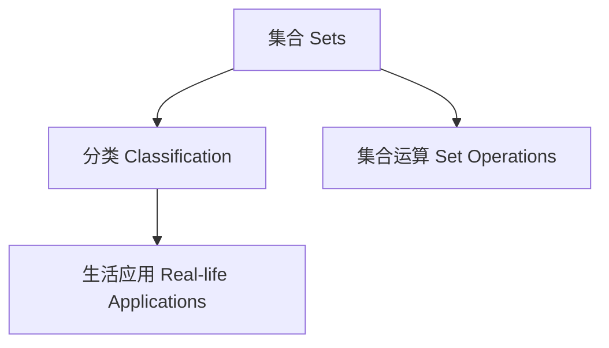

# 数字化与可视化资源 Digital & Visualization Resources

## 一、知识图谱 Knowledge Graphs

- 集合与分类、结构与关系、哲学与思辨等模块均可用Mermaid、XMind等工具绘制知识图谱
- Knowledge graphs for sets, structure, and philosophy modules can be created using tools like Mermaid, XMind, etc.

### 示例：集合与分类知识图谱（Mermaid）

## 二、思维导图模板 Mind Map Templates

- 推荐使用XMind、MindMeister等工具，模板结构包括：主题-分支-子主题-案例
- Use XMind, MindMeister, etc. Templates: Topic - Branch - Subtopic - Case

## 三、互动课件建议 Interactive Courseware Suggestions

- 利用GeoGebra、Khan Academy等平台制作集合运算、结构关系、哲学思辨的互动课件
- Use GeoGebra, Khan Academy, etc. to create interactive courseware for set operations, structure relations, and philosophical thinking

## 四、数字化工具推荐 Digital Tools Recommendation

- XMind、MindMeister（思维导图）
- GeoGebra（数学建模与可视化）
- PhET（科学与数学仿真）
- Mermaid（文本化知识图谱）
- Google Jamboard（协作白板）
- XMind, MindMeister (mind mapping)
- GeoGebra (math modeling & visualization)
- PhET (science & math simulations)
- Mermaid (text-based knowledge graphs)
- Google Jamboard (collaborative whiteboard)

---

> 数字化与可视化资源有助于提升内容的结构化、交互性和易用性，建议结合实际教学灵活应用。

Digital and visualization resources enhance structure, interactivity, and usability. Flexible application in teaching is recommended.
