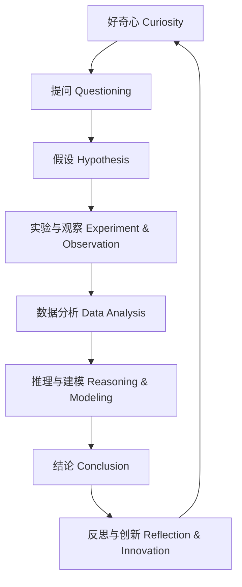

# 1-1 科学思维-概念与发展 Scientific Thinking - Concepts & Development

## 一、科学思维定义 Definition of Scientific Thinking

**中文**：科学思维是一种以证据为基础、逻辑推理和批判性分析为核心，强调实证、创新和系统性的思维方式。

**English**: Scientific thinking is a way of thinking based on evidence, logical reasoning, and critical analysis, emphasizing empiricism, innovation, and systematic approaches.

---

## 二、科学思维的核心特征 Key Features

- 实证性 Empiricism
- 逻辑性 Logic
- 批判性 Criticism
- 创新性 Innovation
- 系统性 Systematic Approach
- 可证伪性 Falsifiability

---

## 三、科学思维的发展阶段 Developmental Stages

| 年龄 Age | 阶段 Stage | 主要特征 Main Features |
|---------|-----------|---------------------|
| 3-5岁   | 好奇探索 Curious Exploration | 感官体验、提问、简单观察 Sensory experience, questioning, simple observation |
| 6-8岁   | 问题提出 Questioning | 能提出问题、初步假设 Able to ask questions, make initial hypotheses |
| 9-11岁  | 假设与验证 Hypothesis & Verification | 能设计简单实验、收集数据 Design simple experiments, collect data |
| 12岁以上 | 推理与建模 Reasoning & Modeling | 逻辑推理、模型构建、批判性分析 Logical reasoning, modeling, critical analysis |

---

## 四、科学思维的价值与意义 Value & Significance

- 培养理性与批判性思维 Fosters rational and critical thinking
- 提升问题解决能力 Enhances problem-solving skills
- 促进创新与创造力 Promotes innovation and creativity
- 形成科学素养 Develops scientific literacy
- 支持终身学习 Supports lifelong learning

---

## 五、国际标准映射 International Standards Alignment

- **NGSS (USA)**: Science and Engineering Practices, Crosscutting Concepts
- **IB PYP/MYP**: Inquiry-based learning, Approaches to Learning (ATL)
- **UK National Curriculum**: Working scientifically
- **Singapore/Finland**: Scientific inquiry, critical thinking
- **中国义务教育**：科学思维、科学方法、创新能力

---

## 六、结构化认知梳理 Structured Cognitive Mapping

---

> 科学思维的发展是科学教育的核心目标，也是国际课程标准的共同要求。

The development of scientific thinking is a core goal of science education and a common requirement of international curriculum standards.
