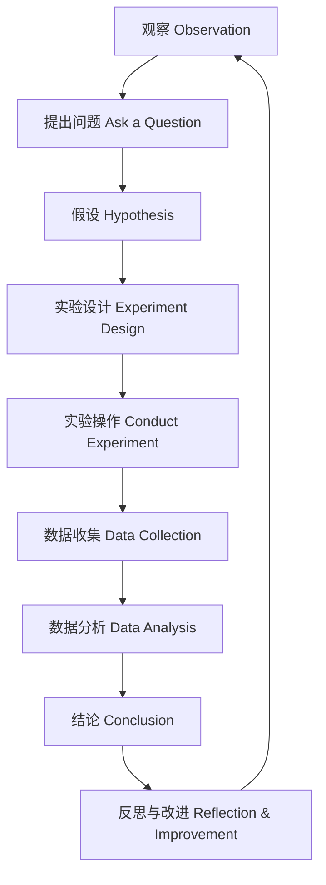

# 1-2 科学方法-观察与实验 Scientific Methods - Observation & Experiment

## 一、观察法 Observation Method

**定义 Definition**:

- 中文：观察法是通过感官或工具对自然现象进行系统记录和分析的方法。
- English: Observation is a method of systematically recording and analyzing natural phenomena using senses or tools.

**类型 Types**:

- 定性观察 Qualitative Observation
- 定量观察 Quantitative Observation
- 比较观察 Comparative Observation
- 系统观察 Systematic Observation

---

## 二、实验法 Experimental Method

**定义 Definition**:

- 中文：实验法是通过有计划地控制变量，验证假设、发现规律的科学方法。
- English: Experimental method is a scientific approach that verifies hypotheses and discovers laws by systematically controlling variables.

**基本流程 Basic Process**:

1. 提出问题 Ask a question
2. 形成假设 Form a hypothesis
3. 设计实验 Design an experiment
4. 实施实验 Conduct the experiment
5. 收集与分析数据 Collect & analyze data
6. 得出结论 Draw a conclusion

---

## 三、关键技能 Key Skills

- 细致观察 Careful observation
- 精确测量 Accurate measurement
- 公正记录 Fair recording
- 严格控制变量 Strict control of variables
- 数据分析 Data analysis
- 结果解释 Result interpretation

---

## 四、国际标准映射 International Standards Alignment

- **NGSS (USA)**: Planning and carrying out investigations
- **IB PYP/MYP**: Inquiry cycle, scientific investigation
- **UK National Curriculum**: Observing, testing, recording
- **Singapore/Finland**: Scientific inquiry, hands-on experiment
- **中国义务教育**：观察与实验、科学探究

---

## 五、结构化认知梳理 Structured Cognitive Mapping

---

> 观察与实验是科学探究的基础，是培养科学思维和实践能力的核心环节。

Observation and experiment are the foundation of scientific inquiry and the core of developing scientific thinking and practical skills.
