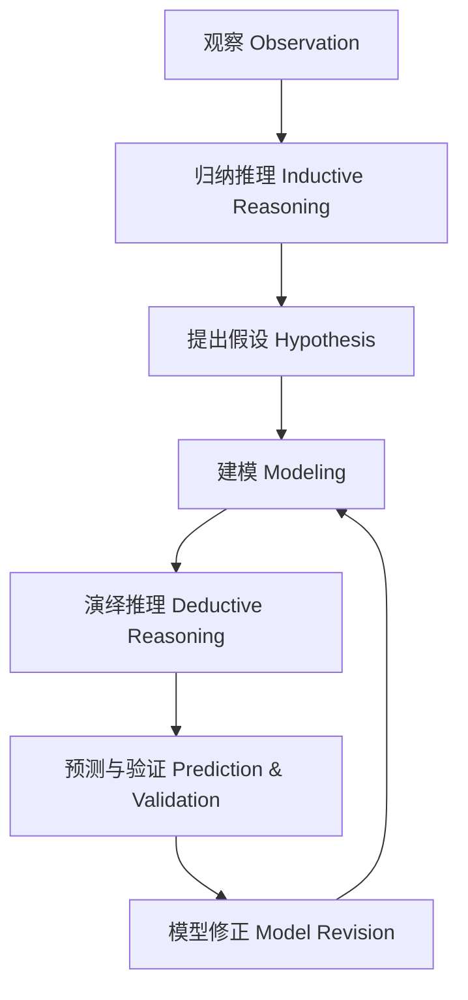

# 1-3 推理与建模 Reasoning & Modeling

## 一、推理类型 Types of Reasoning

- **归纳推理 Inductive Reasoning**
  - 中文：从具体事实中总结出一般规律。
  - English: Drawing general conclusions from specific facts.
- **演绎推理 Deductive Reasoning**
  - 中文：从一般原理推导出具体结论。
  - English: Deriving specific conclusions from general principles.

---

## 二、建模方法 Modeling Methods

- **物理模型 Physical Model**
  - 实物或三维结构 Physical or 3D structure
- **数学模型 Mathematical Model**
  - 用公式、方程描述关系 Mathematical equations and formulas
- **概念模型 Conceptual Model**
  - 用图示、流程图等表达概念关系 Diagrams, flowcharts, etc.
- **计算机模型 Computational Model**
  - 用计算机程序模拟复杂系统 Computer simulations

---

## 三、关键技能 Key Skills

- 归纳与演绎能力 Inductive & deductive skills
- 抽象与简化能力 Abstraction & simplification
- 变量识别与关系分析 Identifying variables & analyzing relationships
- 模型构建与验证 Building & validating models
- 逻辑表达与沟通 Logical expression & communication

---

## 四、国际标准映射 International Standards Alignment

- **NGSS (USA)**: Developing and using models, Constructing explanations
- **IB PYP/MYP**: Modeling, Reasoning, Conceptual understanding
- **UK National Curriculum**: Using models, Scientific reasoning
- **Singapore/Finland**: Modeling, Reasoning
- **中国义务教育**：模型建构、科学推理

---

## 五、结构化认知梳理 Structured Cognitive Mapping

---

> 推理与建模是科学探究的高级阶段，是连接理论与现实、促进创新的关键环节。

Reasoning and modeling are advanced stages of scientific inquiry, bridging theory and reality, and fostering innovation.
