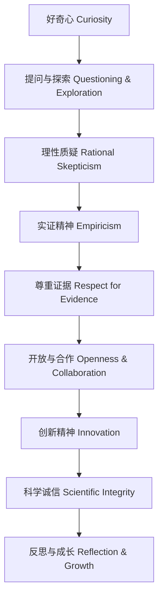

# 1-4 科学精神与态度 Scientific Spirit & Attitude

## 一、科学精神核心要素 Core Elements of Scientific Spirit

- 好奇心 Curiosity
- 求真务实 Pursuit of truth & pragmatism
- 理性质疑 Rational skepticism
- 实证精神 Empiricism
- 开放与合作 Openness & collaboration
- 创新精神 Innovation
- 科学诚信 Scientific integrity

---

## 二、科学态度表现 Scientific Attitudes

- 勇于提问 Willingness to ask questions
- 乐于探索 Enthusiasm for exploration
- 尊重证据 Respect for evidence
- 接受不确定性 Acceptance of uncertainty
- 承认错误与修正 Acknowledging and correcting mistakes
- 团队合作 Teamwork

---

## 三、培养途径 Ways to Foster Scientific Spirit & Attitude

- 创设探究情境 Creating inquiry-based scenarios
- 鼓励质疑与讨论 Encouraging questioning & discussion
- 强调证据与实验 Emphasizing evidence & experimentation
- 反思与自我修正 Reflection & self-correction
- 多元合作与交流 Collaborative learning
- 榜样示范 Role modeling

---

## 四、国际标准映射 International Standards Alignment

- **NGSS (USA)**: Science practices, Attitudes
- **IB PYP/MYP**: Learner profile, Approaches to learning
- **UK National Curriculum**: Scientific attitudes
- **Singapore/Finland**: Scientific values & attitudes
- **中国义务教育**：科学精神、科学态度

---

## 五、结构化认知梳理 Structured Cognitive Mapping

---

> 科学精神与态度是科学教育的灵魂，是培养终身学习者和创新人才的基础。

Scientific spirit and attitude are the soul of science education and the foundation for cultivating lifelong learners and innovators.
