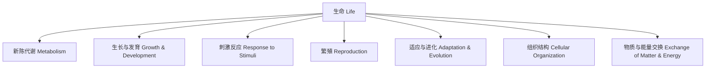

# 2-1 生命的基本特征 Basic Characteristics of Life

## 一、生命的定义 Definition of Life

- 中文：生命是指具有新陈代谢、能繁殖、能对环境做出反应等特征的有机体。
- English: Life refers to organisms that possess characteristics such as metabolism, reproduction, and the ability to respond to the environment.

---

## 二、生命的七大基本特征 Seven Basic Characteristics of Life

1. 新陈代谢 Metabolism
2. 生长与发育 Growth & Development
3. 刺激反应 Response to Stimuli
4. 繁殖 Reproduction
5. 适应与进化 Adaptation & Evolution
6. 组织结构 Cellular Organization
7. 物质与能量交换 Exchange of Matter & Energy

---

## 三、典型案例 Typical Examples

- 植物通过光合作用制造养分（新陈代谢）
- 青蛙从蝌蚪发育为成体（生长与发育）
- 人类遇到危险会逃跑（刺激反应）
- 细菌分裂繁殖（繁殖）
- 北极熊适应寒冷环境（适应与进化）
- 所有生物都由细胞组成（组织结构）
- 动物进食获取能量（物质与能量交换）

---

## 四、国际标准映射 International Standards Alignment

- **NGSS (USA)**: Structure and function, Growth and development, Adaptation
- **IB PYP/MYP**: Living things, Biological systems
- **UK National Curriculum**: Characteristics of living things
- **Singapore/Finland**: Life processes, Adaptation
- **中国义务教育**：生命的基本特征、生物与环境

---

## 五、结构化认知梳理 Structured Cognitive Mapping

---

> 生命的基本特征是理解生物学和生命科学的基础，是各国科学课程标准的核心内容。

The basic characteristics of life are the foundation of biology and life science, and a core part of science curricula worldwide.
