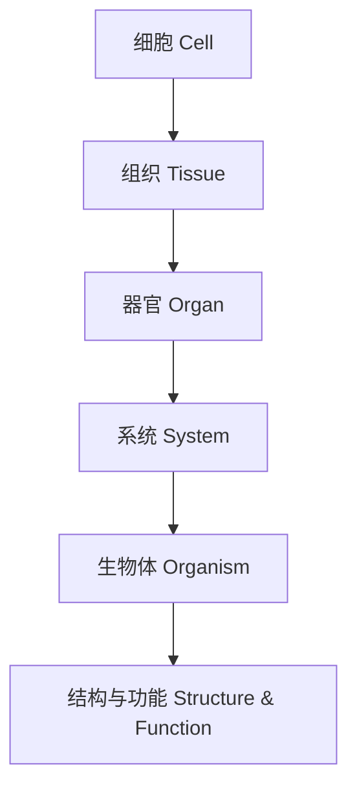

# 2-2 生物结构与功能 Structure & Function of Organisms

## 一、细胞与组织 Cells & Tissues

- 细胞是生命的基本单位 Cells are the basic units of life
- 组织由相同功能的细胞组成 Tissues are made of similar cells

## 二、器官与系统 Organs & Systems

- 器官由不同类型的组织组成 Organs are made of different tissues
- 系统由多个器官协同工作 Systems are composed of multiple organs working together

## 三、结构与功能的关系 Structure-Function Relationship

- 生物体的结构决定其功能 The structure of an organism determines its function
- 例如：鸟的翅膀适合飞行，鱼的鳃适合呼吸 Birds' wings are adapted for flying, fish gills for breathing

## 四、典型案例 Typical Examples

- 红细胞运输氧气 Red blood cells transport oxygen
- 植物叶片进行光合作用 Plant leaves perform photosynthesis
- 人体消化系统分解食物 Human digestive system breaks down food

## 五、国际标准映射 International Standards Alignment

- **NGSS (USA)**: Structure and function, Organization of living things
- **IB PYP/MYP**: Biological systems, Structure and function
- **UK National Curriculum**: Cells, tissues, organs, systems
- **Singapore/Finland**: Structure and function, Life processes
- **中国义务教育**：细胞、组织、器官、系统、结构与功能

## 六、结构化认知梳理 Structured Cognitive Mapping

---

> 理解生物结构与功能的层次关系，是生命科学学习的核心。

Understanding the hierarchical relationship of structure and function is central to learning life science.
