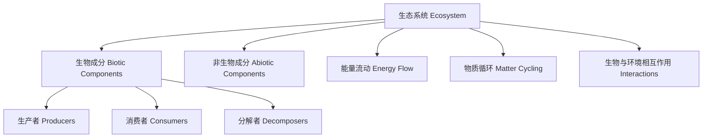

# 2-3 生态系统与环境 Ecosystems & Environment

## 一、生态系统定义与组成 Definition & Components of Ecosystem

- 中文：生态系统是由生物（动植物、微生物）与其所处的非生物环境（阳光、水、空气、土壤等）共同组成的功能整体。
- English: An ecosystem is a functional unit formed by living organisms (plants, animals, microorganisms) and their non-living environment (sunlight, water, air, soil, etc.).

**主要组成 Main Components**:

- 生产者 Producers（如绿色植物）
- 消费者 Consumers（如动物）
- 分解者 Decomposers（如细菌、真菌）
- 非生物环境 Abiotic environment

---

## 二、能量流动与物质循环 Energy Flow & Matter Cycling

- 能量流动：阳光能量通过光合作用进入生态系统，并沿食物链逐级传递。
- 物质循环：水、碳、氮等元素在生物与环境之间不断循环。
- Energy flows: Solar energy enters the ecosystem via photosynthesis and is transferred through the food chain.
- Matter cycles: Elements like water, carbon, and nitrogen cycle between organisms and the environment.

---

## 三、生物与环境的相互关系 Interactions between Organisms & Environment

- 生物影响环境：如植物改善空气质量，动物影响土壤结构。
- 环境影响生物：如气候变化影响生物分布。
- Organisms affect the environment: e.g., plants improve air quality, animals affect soil structure.
- Environment affects organisms: e.g., climate change affects species distribution.

---

## 四、典型案例 Typical Examples

- 森林生态系统 Forest ecosystem
- 池塘生态系统 Pond ecosystem
- 草原生态系统 Grassland ecosystem
- 城市生态系统 Urban ecosystem

---

## 五、国际标准映射 International Standards Alignment

- **NGSS (USA)**: Ecosystems, Interactions, Energy, and Dynamics
- **IB PYP/MYP**: Interactions, Systems, Environments
- **UK National Curriculum**: Interdependence, Adaptation, Environment
- **Singapore/Finland**: Ecosystems, Environmental interactions
- **中国义务教育**：生态系统与环境、生物与环境的关系

---

## 六、结构化认知梳理 Structured Cognitive Mapping

---

> 生态系统与环境的理解有助于学生认识人与自然的关系，培养可持续发展的意识。

Understanding ecosystems and the environment helps students recognize the relationship between humans and nature, fostering awareness of sustainable development.
