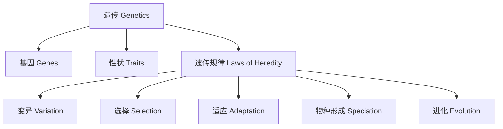

# 2-4 遗传与进化 Genetics & Evolution

## 一、遗传的基本概念 Basic Concepts of Genetics

- 中文：遗传是指生物将性状从亲代传递给子代的过程。
- English: Genetics is the process by which organisms pass traits from parents to offspring.
- 基因是遗传信息的基本单位 Genes are the basic units of heredity
- 性状包括外貌、能力等 Traits include appearance, abilities, etc.

---

## 二、进化的基本原理 Basic Principles of Evolution

- 中文：进化是生物在长期自然选择作用下，逐渐适应环境并产生新物种的过程。
- English: Evolution is the process by which organisms gradually adapt to their environment and new species arise through natural selection over time.
- 变异 Variation
- 选择 Selection
- 适应 Adaptation
- 物种形成 Speciation

---

## 三、典型案例 Typical Examples

- 豌豆的高矮遗传（孟德尔实验） Pea plant height inheritance (Mendel's experiment)
- 长颈鹿脖子变长（适应进化） Giraffe's long neck (adaptive evolution)
- 人类肤色多样性（遗传变异） Human skin color diversity (genetic variation)

---

## 四、国际标准映射 International Standards Alignment

- **NGSS (USA)**: Heredity, Biological evolution
- **IB PYP/MYP**: Genetics, Evolution
- **UK National Curriculum**: Inheritance, Evolution
- **Singapore/Finland**: Genetics, Adaptation, Evolution
- **中国义务教育**：遗传与进化、性状变异

---

## 五、结构化认知梳理 Structured Cognitive Mapping

---

> 遗传与进化的知识帮助学生理解生物多样性和生命的延续，是生命科学的重要组成部分。

Knowledge of genetics and evolution helps students understand biodiversity and the continuity of life, which are essential parts of life science.
