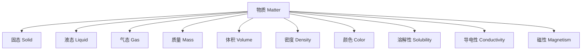

# 3-1 物质的基本性质 Properties of Matter

## 一、物质的定义 Definition of Matter

- 中文：物质是指具有质量和体积、能够占据空间的东西。
- English: Matter is anything that has mass and volume and occupies space.

---

## 二、物质的三态 Three States of Matter

1. 固态 Solid
2. 液态 Liquid
3. 气态 Gas

---

## 三、主要物理性质 Main Physical Properties

- 质量 Mass
- 体积 Volume
- 密度 Density
- 颜色 Color
- 状态 State
- 溶解性 Solubility
- 导电性 Conductivity
- 磁性 Magnetism

---

## 四、典型案例 Typical Examples

- 冰、水、蒸汽分别代表水的三态 Ice, water, and steam represent the three states of water
- 铁有磁性 Iron is magnetic
- 盐能溶于水 Salt is soluble in water

---

## 五、国际标准映射 International Standards Alignment

- **NGSS (USA)**: Structure and properties of matter
- **IB PYP/MYP**: Properties and uses of materials
- **UK National Curriculum**: States of matter, Properties of materials
- **Singapore/Finland**: Properties of matter, Materials
- **中国义务教育**：物质的基本性质、三态变化

---

## 六、结构化认知梳理 Structured Cognitive Mapping

---

> 物质的基本性质是理解自然界和科学实验的基础，是物质科学的重要内容。

The properties of matter are fundamental to understanding the natural world and scientific experiments, and are a key part of physical science.
