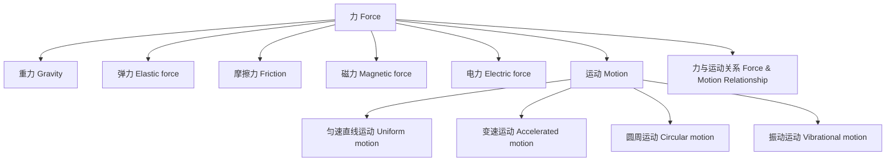

# 3-2 力与运动 Force & Motion

## 一、力的定义与类型 Definition & Types of Force

- 力是使物体发生运动状态变化的作用 Force is a push or pull that changes the state of motion of an object
- 主要类型 Main types:
  - 重力 Gravity
  - 弹力 Elastic force
  - 摩擦力 Friction
  - 磁力 Magnetic force
  - 电力 Electric force

---

## 二、运动的基本形式 Basic Forms of Motion

- 匀速直线运动 Uniform linear motion
- 变速运动 Accelerated motion
- 圆周运动 Circular motion
- 振动运动 Vibrational motion

---

## 三、力与运动的关系 Relationship between Force & Motion

- 力可以改变物体的运动状态 Force can change the state of motion of an object
- 没有外力，静止的物体保持静止，运动的物体保持匀速直线运动（惯性） Without external force, an object at rest stays at rest, and an object in motion stays in uniform motion (inertia)

---

## 四、典型案例 Typical Examples

- 推桌子使其移动 Pushing a desk makes it move
- 滚动的球因摩擦力逐渐停下 A rolling ball stops due to friction
- 磁铁吸引铁钉 Magnet attracts iron nails

---

## 五、国际标准映射 International Standards Alignment

- **NGSS (USA)**: Forces and motion
- **IB PYP/MYP**: Forces, Motion
- **UK National Curriculum**: Forces, Motion
- **Singapore/Finland**: Forces, Motion
- **中国义务教育**：力与运动、基本力学

---

## 六、结构化认知梳理 Structured Cognitive Mapping

---

> 力与运动的知识帮助学生理解自然界的变化规律，是物理学和工程学的基础。

Knowledge of force and motion helps students understand the laws of change in the natural world, forming the foundation of physics and engineering.
