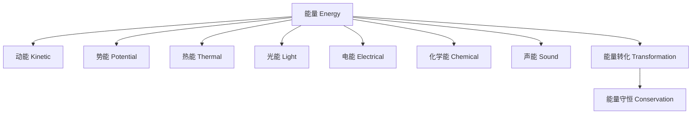

# 3-3 能量与变化 Energy & Change

## 一、能量的定义与形式 Definition & Forms of Energy

- 中文：能量是物体做功的能力。
- English: Energy is the ability to do work.

**主要形式 Main Forms**:

- 动能 Kinetic energy
- 势能 Potential energy
- 热能 Thermal energy
- 光能 Light energy
- 电能 Electrical energy
- 化学能 Chemical energy
- 声能 Sound energy

---

## 二、能量的转化与守恒 Energy Transformation & Conservation

- 能量可以从一种形式转化为另一种形式 Energy can be transformed from one form to another
- 能量在转化过程中总量保持不变（能量守恒定律） The total amount of energy remains constant during transformation (law of conservation of energy)

---

## 三、典型案例 Typical Examples

- 电池将化学能转化为电能 Batteries convert chemical energy to electrical energy
- 电灯将电能转化为光能和热能 Light bulbs convert electrical energy to light and heat
- 人体运动将化学能转化为动能 Human movement converts chemical energy to kinetic energy

---

## 四、国际标准映射 International Standards Alignment

- **NGSS (USA)**: Energy, Energy transfer and conservation
- **IB PYP/MYP**: Energy, Change
- **UK National Curriculum**: Energy, Changes of state
- **Singapore/Finland**: Energy, Energy changes
- **中国义务教育**：能量的形式与转化、能量守恒

---

## 五、结构化认知梳理 Structured Cognitive Mapping

---

> 能量与变化的知识帮助学生理解自然界的运行机制，是物理、化学和工程学的重要基础。

Knowledge of energy and change helps students understand the mechanisms of the natural world, forming an important foundation for physics, chemistry, and engineering.
