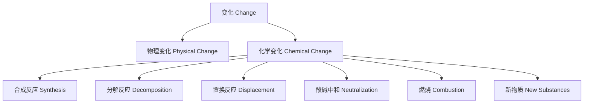

# 3-4 化学变化与反应 Chemical Changes & Reactions

## 一、化学变化定义 Definition of Chemical Change

- 中文：化学变化是指物质发生本质变化，生成新物质的过程。
- English: Chemical change refers to a process in which substances undergo fundamental changes to form new substances.

---

## 二、常见化学反应类型 Common Types of Chemical Reactions

- 合成反应 Synthesis reaction
- 分解反应 Decomposition reaction
- 置换反应 Displacement reaction
- 酸碱中和反应 Acid-base neutralization
- 燃烧反应 Combustion

---

## 三、物理变化与化学变化的区别 Difference between Physical & Chemical Changes

- 物理变化不生成新物质 Physical change does not produce new substances
- 化学变化生成新物质 Chemical change produces new substances
- 例：水的蒸发是物理变化，铁生锈是化学变化 Example: Water evaporation is a physical change, iron rusting is a chemical change

---

## 四、典型案例 Typical Examples

- 铁生锈 Iron rusting
- 木材燃烧 Wood burning
- 食物腐败 Food spoilage
- 水的蒸发 Water evaporation (物理变化 Physical change)

---

## 五、国际标准映射 International Standards Alignment

- **NGSS (USA)**: Chemical reactions, Changes in matter
- **IB PYP/MYP**: Chemical change, Reactions
- **UK National Curriculum**: Chemical changes, Reactions
- **Singapore/Finland**: Chemical changes, Reactions
- **中国义务教育**：化学变化与反应、物理变化与化学变化

---

## 六、结构化认知梳理 Structured Cognitive Mapping

---

> 化学变化与反应的知识帮助学生理解物质世界的本质，是化学学科的核心内容。

Knowledge of chemical changes and reactions helps students understand the essence of the material world and is a core part of chemistry.
