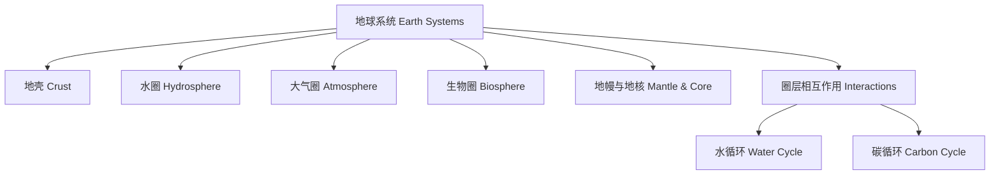

# 4-1 地球系统 Earth Systems

## 一、地球的主要圈层 Main Spheres of the Earth

- 地壳（岩石圈） Crust (Lithosphere)
- 水圈 Hydrosphere
- 大气圈 Atmosphere
- 生物圈 Biosphere
- 地幔与地核 Mantle & Core

---

## 二、地球系统的相互作用 Interactions of Earth Systems

- 各圈层之间相互影响、相互作用 The spheres interact and influence each other
- 例如：水循环涉及大气圈、水圈和地壳 Water cycle involves atmosphere, hydrosphere, and crust
- 生物圈与大气圈的气体交换 Gas exchange between biosphere and atmosphere

---

## 三、典型案例 Typical Examples

- 水循环 Water cycle
- 碳循环 Carbon cycle
- 火山喷发 Volcano eruption
- 森林对气候的影响 Forests affect climate

---

## 四、国际标准映射 International Standards Alignment

- **NGSS (USA)**: Earth systems, Cycles of matter
- **IB PYP/MYP**: Systems, Interactions
- **UK National Curriculum**: Earth structure, Cycles
- **Singapore/Finland**: Earth systems, Environmental cycles
- **中国义务教育**：地球圈层、地球系统、物质循环

---

## 五、结构化认知梳理 Structured Cognitive Mapping

---

> 地球系统的知识帮助学生理解地球作为一个整体的运行机制，是环境科学和地理学的重要基础。

Knowledge of earth systems helps students understand the mechanisms of the Earth as a whole, forming an important foundation for environmental science and geography.
