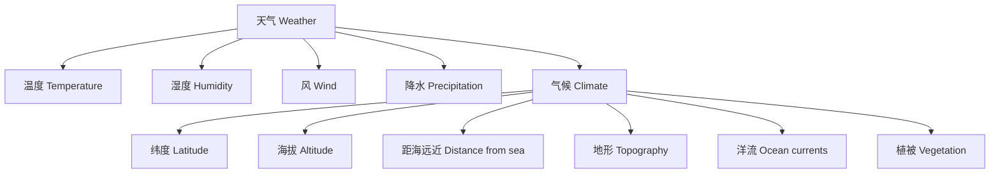

# 4-2 天气与气候 Weather & Climate

## 一、天气与气候的定义 Definitions

- 天气：短时间内大气的状态（如温度、湿度、风、降水等）
- Weather: The state of the atmosphere at a given time and place (e.g., temperature, humidity, wind, precipitation)
- 气候：一个地区长期的平均天气状况
- Climate: The average weather conditions of a region over a long period

---

## 二、主要影响因素 Main Influencing Factors

- 纬度 Latitude
- 海拔 Altitude
- 距海远近 Distance from the sea
- 地形 Topography
- 洋流 Ocean currents
- 植被 Vegetation

---

## 三、典型案例 Typical Examples

- 热带雨林气候 Tropical rainforest climate
- 沙漠气候 Desert climate
- 季风气候 Monsoon climate
- 台风、暴雨等极端天气 Extreme weather events (typhoon, heavy rain)

---

## 四、国际标准映射 International Standards Alignment

- **NGSS (USA)**: Weather and climate, Patterns
- **IB PYP/MYP**: Weather, Climate, Patterns
- **UK National Curriculum**: Weather, Climate, Environmental factors
- **Singapore/Finland**: Weather, Climate
- **中国义务教育**：天气与气候、气象灾害

---

## 五、结构化认知梳理 Structured Cognitive Mapping

---

> 天气与气候的知识帮助学生理解自然环境的变化规律，是地理学和环境科学的重要内容。

Knowledge of weather and climate helps students understand the patterns of natural environments, which is important for geography and environmental science.
