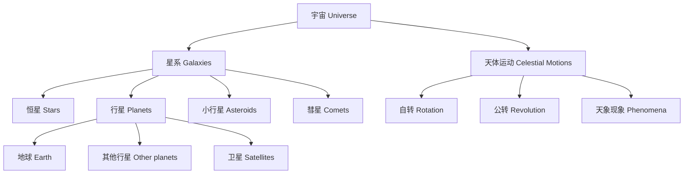

# 4-3 宇宙与天体 Universe & Astronomy

## 一、宇宙的基本结构 Basic Structure of the Universe

- 宇宙由星系、恒星、行星、卫星等天体组成
- The universe is made up of galaxies, stars, planets, satellites, and other celestial bodies

---

## 二、太阳系与主要天体 The Solar System & Major Celestial Bodies

- 太阳 Sun
- 八大行星 Eight planets
- 卫星（如月球） Satellites (e.g., the Moon)
- 小行星、彗星 Asteroids, comets

---

## 三、天体运动与现象 Celestial Motions & Phenomena

- 地球自转与公转 Earth's rotation and revolution
- 月相变化 Phases of the Moon
- 日食与月食 Solar and lunar eclipses
- 四季变化 Seasons

---

## 四、典型案例 Typical Examples

- 白天与黑夜的形成 Formation of day and night
- 月亮的盈亏 Phases of the Moon
- 日食和月食 Solar and lunar eclipses
- 行星逆行 Apparent retrograde motion of planets

---

## 五、国际标准映射 International Standards Alignment

- **NGSS (USA)**: Universe and its stars, Earth and the solar system
- **IB PYP/MYP**: Space, Astronomy
- **UK National Curriculum**: Earth and space, Celestial bodies
- **Singapore/Finland**: Astronomy, Solar system
- **中国义务教育**：宇宙与天体、太阳系、天体运动

---

## 六、结构化认知梳理 Structured Cognitive Mapping

---

> 宇宙与天体的知识帮助学生拓展视野，理解地球在宇宙中的位置，是科学素养的重要组成部分。

Knowledge of the universe and astronomy broadens students' horizons, helps them understand Earth's place in the universe, and is an important part of scientific literacy.
