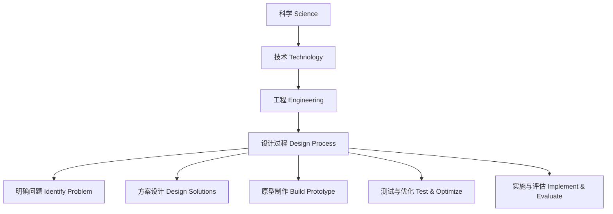

# 5-1 科学技术与工程 Science, Technology & Engineering

## 一、科学与技术的关系 Relationship between Science & Technology

- 科学是探索自然规律，技术是应用科学知识解决实际问题
- Science explores natural laws, technology applies scientific knowledge to solve real-world problems

---

## 二、工程设计过程 Engineering Design Process

1. 明确问题 Identify the problem
2. 方案设计 Design solutions
3. 原型制作 Build a prototype
4. 测试与优化 Test and optimize
5. 实施与评估 Implement and evaluate

---

## 三、典型案例 Typical Examples

- 桥梁建造 Bridge construction
- 智能手机的发明 Invention of smartphones
- 节能灯的设计 Design of energy-saving lamps

---

## 四、国际标准映射 International Standards Alignment

- **NGSS (USA)**: Engineering design, Applications of science
- **IB PYP/MYP**: Design, Technology
- **UK National Curriculum**: Design and technology, Engineering
- **Singapore/Finland**: Technology, Engineering
- **中国义务教育**：科学与技术、工程设计

---

## 五、结构化认知梳理 Structured Cognitive Mapping

---

> 科学、技术与工程的融合培养学生创新能力和解决实际问题的能力，是现代科学教育的重要方向。

The integration of science, technology, and engineering fosters students' innovation and problem-solving skills, which is a key direction in modern science education.
