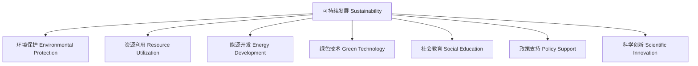

# 5-2 科学与可持续发展 Science & Sustainability

## 一、可持续发展的定义 Definition of Sustainability

- 中文：可持续发展是指既满足当代人的需求，又不损害后代人满足其需求能力的发展模式。
- English: Sustainability refers to a development model that meets the needs of the present without compromising the ability of future generations to meet their own needs.

---

## 二、科学在可持续发展中的作用 Role of Science in Sustainability

- 科学为环境保护、资源利用、能源开发等提供理论和技术支持
- Science provides theoretical and technical support for environmental protection, resource utilization, energy development, etc.
- 推动绿色技术创新 Promotes green technology innovation
- 支持政策制定与社会教育 Supports policy making and public education

---

## 三、典型案例 Typical Examples

- 可再生能源开发（如太阳能、风能） Development of renewable energy (e.g., solar, wind)
- 垃圾分类与循环利用 Waste sorting and recycling
- 生态农业与有机食品 Ecological agriculture and organic food
- 节能减排 Energy saving and emission reduction

---

## 四、国际标准映射 International Standards Alignment

- **NGSS (USA)**: Human impacts, Sustainability
- **IB PYP/MYP**: Global contexts, Sustainability
- **UK National Curriculum**: Sustainable development, Environmental education
- **Singapore/Finland**: Sustainability, Environmental responsibility
- **中国义务教育**：可持续发展、环境保护

---

## 五、结构化认知梳理 Structured Cognitive Mapping

---

> 科学与可持续发展的结合有助于培养学生的全球视野和社会责任感，是现代科学教育的重要主题。

The integration of science and sustainability helps cultivate students' global vision and sense of social responsibility, which is a key theme in modern science education.
