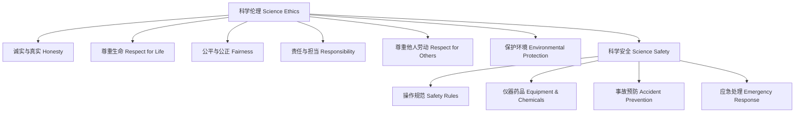

# 5-3 科学伦理与安全 Science Ethics & Safety

## 一、科学伦理的基本原则 Basic Principles of Science Ethics

- 诚实与真实 Honesty & truthfulness
- 尊重生命 Respect for life
- 公平与公正 Fairness & justice
- 责任与担当 Responsibility
- 尊重他人劳动 Respect for others' work
- 保护环境 Environmental protection

---

## 二、科学安全的核心要求 Core Requirements of Science Safety

- 遵守实验操作规范 Follow laboratory safety rules
- 正确使用仪器和药品 Proper use of equipment and chemicals
- 预防事故和伤害 Prevent accidents and injuries
- 保护个人和他人安全 Protect personal and others' safety
- 应急处理 Emergency response

---

## 三、典型案例 Typical Examples

- 实验室安全守则 Laboratory safety rules
- 科学研究中的数据造假 Data falsification in research
- 动物实验的伦理争议 Ethical issues in animal experiments
- 环境污染与社会责任 Environmental pollution and social responsibility

---

## 四、国际标准映射 International Standards Alignment

- **NGSS (USA)**: Science practices, Ethics, Safety
- **IB PYP/MYP**: Ethics, Responsibility
- **UK National Curriculum**: Science ethics, Safety
- **Singapore/Finland**: Ethics, Safety
- **中国义务教育**：科学伦理、实验安全

---

## 五、结构化认知梳理 Structured Cognitive Mapping

---

> 科学伦理与安全教育有助于学生树立正确的价值观和安全意识，是科学素养的重要组成部分。

Science ethics and safety education help students develop correct values and safety awareness, which are essential parts of scientific literacy.
