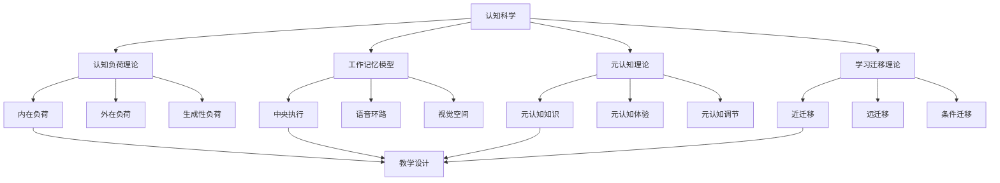

# 教育知识解释与关联性分析

## 概述

教育知识解释与关联性分析是构建国际化教育体系的核心环节，通过深入分析教育概念的内涵、外延、关联关系和应用场景，形成系统化的知识理解框架。本章将从概念解释、关联分析、应用场景三个维度进行全面分析。

## 核心概念解释

### 1. 教育哲学概念解释

#### 1.1 建构主义学习理论

**概念定义**：
建构主义学习理论认为，学习是学习者基于已有经验主动建构新知识的过程，知识不是客观存在的，而是学习者主动建构的。

**核心要素**：

- **主动建构**：学习者主动参与知识建构过程
- **社会互动**：学习在社会互动中进行
- **情境学习**：学习发生在真实情境中
- **反思实践**：通过反思深化理解

**关联理论**：

- **皮亚杰认知发展理论**：强调认知冲突和平衡
- **维果茨基社会文化理论**：强调社会文化的作用
- **布鲁纳发现学习**：强调主动发现和探索

**应用场景**：

- 项目式学习设计
- 探究式学习实施
- 合作学习组织
- 反思性教学实践

#### 1.2 存在主义教育思想

**概念定义**：
存在主义教育思想强调个体的自由选择、责任承担和意义建构，认为人通过自己的行动创造自己的本质。

**核心要素**：

- **自由选择**：个体具有自由选择的能力
- **责任承担**：为自己的选择承担责任
- **意义建构**：主动创造生命的意义
- **个体独特性**：尊重每个个体的独特性

**关联理论**：

- **萨特自由哲学**：强调选择的自由和责任
- **加缪荒谬哲学**：面对荒谬选择反抗
- **海德格尔存在哲学**：关注此在的存在方式

**应用场景**：

- 个性化教育设计
- 价值观教育实施
- 创造力培养
- 人格教育实践

### 2. 认知科学概念解释

#### 2.1 认知负荷理论

**概念定义**：
认知负荷理论研究人类工作记忆处理信息时的认知资源消耗，认为认知资源有限，教学设计应优化认知负荷。

**核心要素**：

- **内在认知负荷**：学习材料本身的复杂性
- **外在认知负荷**：教学设计不当造成的额外负担
- **生成性认知负荷**：学习者主动建构知识时的认知投入

**关联理论**：

- **工作记忆模型**：认知资源的基础理论
- **信息加工理论**：认知过程的解释框架
- **注意力理论**：认知资源分配机制

**应用场景**：

- 教学设计优化
- 学习材料开发
- 多媒体学习设计
- 在线学习平台设计

#### 2.2 元认知理论

**概念定义**：
元认知是对自身认知过程的认知和调节，包括元认知知识、元认知体验和元认知调节三个组成部分。

**核心要素**：

- **元认知知识**：关于认知过程的知识
- **元认知体验**：认知过程中的体验
- **元认知调节**：对认知过程的调节

**关联理论**：

- **自我调节学习**：元认知的应用理论
- **认知策略理论**：具体的认知策略
- **学习动机理论**：动机对元认知的影响

**应用场景**：

- 学习策略教学
- 反思性学习指导
- 自主学习培养
- 学习评价设计

### 3. 教学方法概念解释

#### 3.1 项目式学习

**概念定义**：
项目式学习是一种以真实项目为基础的学习方法，学生通过解决真实问题来学习知识和技能。

**核心要素**：

- **真实问题**：基于真实世界的问题
- **跨学科整合**：整合多学科知识
- **合作学习**：通过合作解决问题
- **成果展示**：展示学习成果

**关联理论**：

- **建构主义理论**：知识主动建构
- **情境学习理论**：真实情境学习
- **合作学习理论**：社会互动学习

**应用场景**：

- 科学教育项目
- 社会研究项目
- 艺术创作项目
- 技术设计项目

#### 3.2 现象教学

**概念定义**：
现象教学是一种以真实现象为基础的教学方法，通过跨学科分析现象来学习知识和技能。

**核心要素**：

- **现象选择**：选择学生感兴趣的现象
- **跨学科分析**：从多学科角度分析
- **学生中心**：以学生兴趣为中心
- **合作探究**：通过合作探究现象

**关联理论**：

- **情境学习理论**：真实情境学习
- **跨学科理论**：学科整合理论
- **学生中心理论**：以学生为中心

**应用场景**：

- 气候变化教育
- 城市交通问题
- 食品安全教育
- 环境保护教育

## 知识关联性分析

### 1. 理论间关联分析

#### 1.1 学习理论关联矩阵

| 理论维度 | 建构主义 | 行为主义 | 认知主义 | 人本主义 |
|----------|----------|----------|----------|----------|
| **知识观** | 主动建构 | 被动接收 | 信息加工 | 个人意义 |
| **学习观** | 社会互动 | 刺激反应 | 认知过程 | 自我实现 |
| **教学观** | 支架支持 | 强化训练 | 认知策略 | 情感支持 |
| **评价观** | 过程评价 | 结果评价 | 认知评价 | 发展评价 |
| **教师角色** | 促进者 | 训练者 | 指导者 | 支持者 |
| **学生角色** | 建构者 | 接收者 | 加工者 | 实现者 |

#### 1.2 认知科学理论关联网络

### 2. 方法间关联分析

#### 2.1 教学方法关联强度

| 方法A | 方法B | 关联类型 | 关联强度 | 关联说明 |
|-------|-------|----------|----------|----------|
| 项目式学习 | 探究式学习 | 互补关系 | 高 | 项目式学习包含探究元素 |
| 合作学习 | 同伴学习 | 包含关系 | 很高 | 合作学习是同伴学习的高级形式 |
| 现象教学 | 跨学科教学 | 应用关系 | 高 | 现象教学是跨学科教学的具体应用 |
| 游戏化学习 | 动机理论 | 支撑关系 | 中 | 游戏化学习基于动机理论 |

#### 2.2 教学方法应用场景

**项目式学习应用场景**：

- **科学教育**：科学实验项目、工程设计项目
- **社会研究**：社区调查项目、历史研究项目
- **艺术教育**：艺术创作项目、文化研究项目
- **技术教育**：技术设计项目、创新发明项目

**现象教学应用场景**：

- **环境教育**：气候变化、生物多样性
- **社会教育**：城市化、全球化
- **健康教育**：营养健康、心理健康
- **经济教育**：消费行为、经济发展

### 3. 理论与实践关联分析

#### 3.1 理论指导实践的关系

**建构主义指导教学实践**：

- **支架式教学**：教师提供支架支持学生建构
- **抛锚式教学**：以真实问题为锚点
- **随机进入教学**：从不同角度进入学习
- **认知学徒制**：专家指导新手学习

**认知负荷理论指导教学设计**：

- **分步教学**：将复杂任务分解
- **样例学习**：提供完整样例
- **工作示例**：展示解决过程
- **冗余消除**：避免重复信息

#### 3.2 实践验证理论的关系

**教学实践验证学习理论**：

- **课堂观察**：观察学习过程验证理论
- **学习效果评估**：评估学习效果验证理论
- **学生反馈**：收集学生反馈验证理论
- **教师反思**：教师反思验证理论

## 知识应用场景分析

### 1. 教学设计应用

#### 1.1 基于理论的教学设计

**基于建构主义的教学设计**：

1. **确定学习目标**：基于学生已有经验
2. **设计学习活动**：促进知识建构
3. **提供学习支持**：支架式支持
4. **评价学习效果**：过程性评价

**基于认知负荷理论的教学设计**：

1. **分析认知负荷**：评估学习材料复杂度
2. **优化教学设计**：减少外在认知负荷
3. **提供学习支持**：支持生成性认知负荷
4. **评价学习效果**：评估认知负荷优化效果

#### 1.2 基于方法的教学设计

**项目式学习设计**：

1. **选择项目主题**：选择真实有意义的项目
2. **设计项目任务**：设计具体的项目任务
3. **组织学习活动**：组织合作学习活动
4. **评价项目成果**：评价项目学习成果

**现象教学设计**：

1. **选择现象**：选择学生感兴趣的现象
2. **设计探究问题**：设计跨学科探究问题
3. **组织探究活动**：组织学生探究活动
4. **总结探究结果**：总结探究学习结果

### 2. 学习评价应用

#### 2.1 基于理论的评价设计

**基于建构主义的评价**：

- **过程评价**：评价学习过程
- **多元评价**：采用多种评价方式
- **发展评价**：关注学生发展
- **反思评价**：鼓励学生反思

**基于元认知理论的评价**：

- **自我评价**：学生自我评价
- **同伴评价**：同伴相互评价
- **策略评价**：评价学习策略
- **调节评价**：评价调节能力

#### 2.2 基于方法的评价设计

**项目式学习评价**：

- **项目成果评价**：评价项目成果
- **合作过程评价**：评价合作过程
- **问题解决评价**：评价问题解决能力
- **创新思维评价**：评价创新思维

**现象教学评价**：

- **现象理解评价**：评价现象理解
- **跨学科思维评价**：评价跨学科思维
- **探究能力评价**：评价探究能力
- **综合应用评价**：评价综合应用能力

### 3. 教师发展应用

#### 3.1 基于理论的专业发展

**基于建构主义的教师发展**：

- **反思性实践**：教师反思教学实践
- **合作学习**：教师合作学习
- **情境学习**：在真实情境中学习
- **持续发展**：持续专业发展

**基于元认知理论的教师发展**：

- **教学策略反思**：反思教学策略
- **学习效果监控**：监控学习效果
- **教学方法调节**：调节教学方法
- **专业成长评价**：评价专业成长

#### 3.2 基于方法的专业发展

**项目式学习教师培训**：

- **项目设计培训**：培训项目设计能力
- **合作学习指导**：培训合作学习指导
- **评价方法培训**：培训评价方法
- **技术支持培训**：培训技术支持

**现象教学教师培训**：

- **现象选择培训**：培训现象选择能力
- **跨学科设计培训**：培训跨学科设计
- **探究指导培训**：培训探究指导能力
- **评价设计培训**：培训评价设计能力

## 总结

教育知识解释与关联性分析为构建国际化教育体系提供了重要的理论基础和实践指导。通过深入分析教育概念的内涵、外延、关联关系和应用场景，形成了系统化的知识理解框架。

**核心价值**：

1. **概念清晰**：明确教育概念的内涵和外延
2. **关联明确**：揭示知识间的内在联系
3. **应用具体**：提供具体的应用场景和方法
4. **指导实践**：为教育实践提供理论指导

**应用意义**：

1. **教学设计**：指导教学设计的理论选择和方法应用
2. **学习评价**：指导学习评价的设计和实施
3. **教师发展**：指导教师专业发展的方向和路径
4. **教育改革**：为教育改革提供理论支撑和实践指导

---

**核心贡献**：

- **系统性**：构建完整的教育知识解释体系
- **关联性**：揭示教育知识间的内在联系
- **实用性**：提供具体的应用场景和方法
- **发展性**：支持教育知识的持续发展
