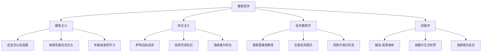
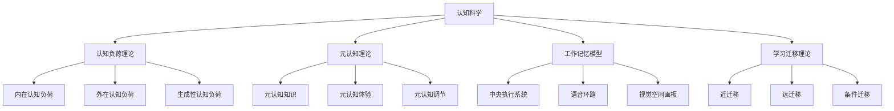
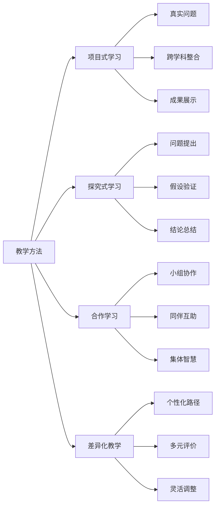
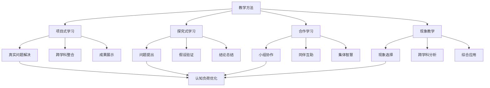

# 知识图谱与关联分析

## 概述

知识图谱是构建国际化教育体系的核心工具，通过系统梳理教育概念、理论、方法之间的关联关系，形成完整的知识网络。本章将深入分析教育知识的解释、关联性和知识图谱构建方法。

## 教育知识图谱构建

### 1. 核心概念网络

#### 1.1 教育哲学概念网络



#### 1.2 认知科学概念网络



### 2. 理论关联分析

#### 2.1 学习理论关联矩阵

| 理论类型 | 建构主义 | 行为主义 | 认知主义 | 人本主义 |
|----------|----------|----------|----------|----------|
| **知识观** | 主动建构 | 被动接收 | 信息加工 | 个人意义 |
| **学习观** | 社会互动 | 刺激反应 | 认知过程 | 自我实现 |
| **教学观** | 支架支持 | 强化训练 | 认知策略 | 情感支持 |
| **评价观** | 过程评价 | 结果评价 | 认知评价 | 发展评价 |

#### 2.2 教学方法关联网络



### 3. 知识解释与定义

#### 3.1 核心概念解释

**建构主义学习理论**：

- **定义**：学习者基于已有经验主动建构新知识的过程
- **核心观点**：知识不是客观存在的，而是学习者主动建构的
- **教育应用**：强调学习者的主动性和社会互动
- **关联理论**：皮亚杰认知发展理论、维果茨基社会文化理论

**认知负荷理论**：

- **定义**：人类工作记忆处理信息时的认知资源消耗
- **核心观点**：认知资源有限，教学设计应优化认知负荷
- **教育应用**：分步教学、样例学习、冗余消除
- **关联理论**：工作记忆模型、信息加工理论

**元认知理论**：

- **定义**：对自身认知过程的认知和调节
- **核心观点**：学习者能够监控和调节自己的学习过程
- **教育应用**：思维可视化、反思日记、同伴互评
- **关联理论**：自我调节学习、认知策略

#### 3.2 概念层次结构

```text
教育知识体系
├── 1. 理论基础层
│   ├── 1.1 哲学基础
│   │   ├── 建构主义哲学
│   │   ├── 存在主义哲学
│   │   └── 批判理论哲学
│   ├── 1.2 心理学基础
│   │   ├── 认知心理学
│   │   ├── 发展心理学
│   │   └── 社会心理学
│   └── 1.3 社会学基础
│       ├── 教育社会学
│       ├── 文化人类学
│       └── 批判教育学
├── 2. 学习理论层
│   ├── 2.1 学习过程理论
│   │   ├── 认知负荷理论
│   │   ├── 工作记忆模型
│   │   └── 学习迁移理论
│   ├── 2.2 学习策略理论
│   │   ├── 元认知理论
│   │   ├── 认知策略理论
│   │   └── 动机理论
│   └── 2.3 学习环境理论
│       ├── 情境学习理论
│       ├── 分布式认知理论
│       └── 活动理论
├── 3. 教学方法层
│   ├── 3.1 传统教学方法
│   │   ├── 讲授法
│   │   ├── 讨论法
│   │   └── 演示法
│   ├── 3.2 现代教学方法
│   │   ├── 项目式学习
│   │   ├── 探究式学习
│   │   └── 合作学习
│   └── 3.3 创新教学方法
│       ├── 现象教学
│       ├── 游戏化学习
│       └── 混合式学习
└── 4. 实践应用层
    ├── 4.1 课程设计
    │   ├── 目标设计
    │   ├── 内容组织
    │   └── 活动设计
    ├── 4.2 教学实施
    │   ├── 课堂管理
    │   ├── 互动策略
    │   └── 技术支持
    └── 4.3 评价反馈
        ├── 形成性评价
        ├── 总结性评价
        └── 发展性评价
```

### 4. 知识关联性分析

#### 4.1 理论间关联强度

| 理论A | 理论B | 关联类型 | 关联强度 | 关联说明 |
|-------|-------|----------|----------|----------|
| 建构主义 | 认知负荷理论 | 互补关系 | 高 | 建构主义强调主动学习，认知负荷理论优化学习过程 |
| 元认知理论 | 自我调节学习 | 包含关系 | 很高 | 元认知是自我调节学习的核心组成部分 |
| 工作记忆模型 | 学习迁移理论 | 支撑关系 | 中 | 工作记忆为学习迁移提供认知基础 |
| 情境学习理论 | 现象教学 | 应用关系 | 高 | 现象教学是情境学习理论的具体应用 |

#### 4.2 方法间关联网络



### 5. 知识图谱应用

#### 5.1 教学设计指导

**基于知识图谱的教学设计流程**：

1. **目标分析**：根据知识图谱确定学习目标
2. **理论选择**：选择适合的理论基础
3. **方法匹配**：匹配相应的教学方法
4. **评价设计**：设计对应的评价方式

#### 5.2 学习路径规划

**个性化学习路径设计**：

- **诊断阶段**：评估学习者现有知识结构
- **规划阶段**：基于知识图谱设计学习路径
- **实施阶段**：按照路径进行学习
- **调整阶段**：根据学习情况调整路径

#### 5.3 知识检索与推荐

**智能知识推荐系统**：

- **基于关联**：推荐相关概念和理论
- **基于层次**：推荐上下级概念
- **基于应用**：推荐实践方法和案例
- **基于个性化**：根据学习者特点推荐

### 6. 知识图谱维护与更新

#### 6.1 更新机制

- **定期审查**：定期审查知识图谱的准确性
- **专家验证**：邀请专家验证知识关联
- **用户反馈**：收集用户使用反馈
- **版本控制**：建立版本控制和更新记录

#### 6.2 质量保障

- **学术标准**：确保知识内容的学术准确性
- **实践验证**：通过实践验证知识关联的有效性
- **跨文化适配**：考虑不同文化背景的适配性
- **持续改进**：基于反馈持续改进知识图谱

## 总结

知识图谱与关联分析是构建国际化教育体系的重要工具，通过系统梳理教育知识的解释、关联性和应用，形成了完整的知识网络。这一知识图谱不仅为教育工作者提供了理论指导，也为学习者提供了个性化的学习路径，是推动教育现代化和国际化发展的重要支撑。

---

**核心价值**：

1. **系统性**：构建完整的教育知识体系
2. **关联性**：揭示知识间的内在联系
3. **实用性**：指导教育实践应用
4. **发展性**：支持持续更新和优化
